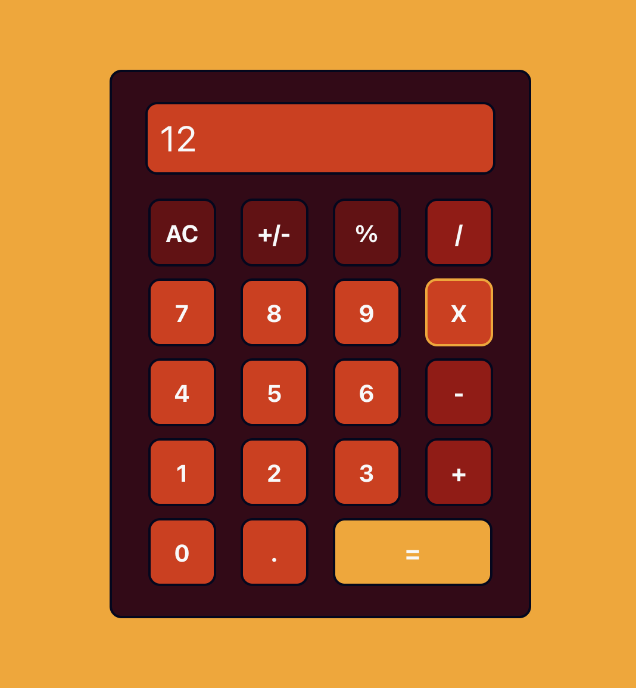

# Calculator App

Basic calculator app mimicking the one found in iPhone.

The calculator app is a React app that was created using Vite and written in TypeScript.

I originally started working on the app during the Full Stack Developer Course in October 2022 (https://github.com/btaskinen/FullStackKoulutus2022/tree/main/laskin). Building the app was used as an introduction to React. Due to time limitation, the app was never finished and when I finally had some free time again, I decided to recreate the app using the code base I created in the course, but this time writing the app in TypeScript.

